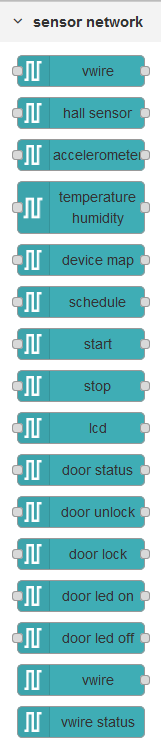
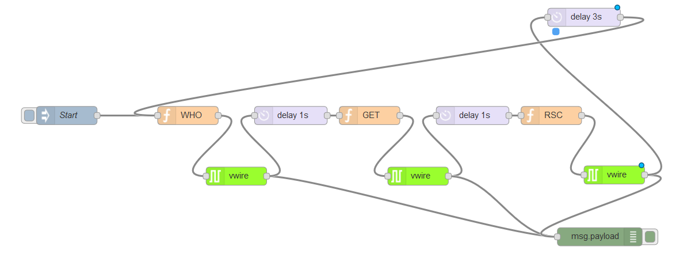

# sensor-network-nodered



## Background and motivation

Generally speaking, the granurarity of nodes on Node-RED is fine-grained (KISS), and some of them are asynchronous (event-driven).

Lately I have been creating miniature things that can be controlled by Node-RED or [Android](https://github.com/araobp/sensor-network-android), as educational materials. However, I have been wondering if children younger than 8 years old can really program Node-RED to control them.

Once I tested [SONY Koov](https://www.sony.com/koov) that has a Scratch-like programming tool, and the programming style is completely synchronous. I also watched a TV program teaching Scatch to kids.

The goal of this project is to see if it is possible to create synchronous and coarse-grained nodes on Node-RED to control my miniature things in a sequence-control manner. Some of them use [this sensor network protocol](https://github.com/araobp/sensor-network).

## Sequence

```

  <--- virtual wire (vwire) --------------------->                Node-RED flow
                                                                        |
Sensor A      MCU          vWire common     vWire node 1                |
   |           |                |    req1        |                      |
   |           |    req1        |<---------------|                      | in
   |           |<----uart-------|                |                      V
   |<---i2c----|                |                |               [vwire node 1]
   |----i2c--->|    res1        |                |                      |
   |           |-----uart------>|    res1        |                      |
   |           |                |--------------->|                      | out
               |                |                                       :
Sensor B       |                |           vWire node 2                :
   |           |                |                |                      |
   |           |                |    req2        |                      |
   |           |    req2        |<---------------|                      | in
   |           |<---uart/usb----|                |                      V
   |<---i2c----|                |                |               [vwire node 2]
   |----i2c--->|    res2        |                |                      |
   |           |----uart/usb--->|    res2        |                      |
   |           |                |--------------->|                      V out


"vwire common" is an instance of serialport attached to a tty (e.g., /dev/ttyUSB0) on Linux
or a COM port on Windows.

```

## Implementation

Assuming that this repo is under /home/pi, modify ~/.node-red/settings.js as follows:

```
nodesDir: '/home/pi/sensor-network-nodered/vwire',
```

I have just made [a minimal implementation](./vwire):
- vwire: control/manage the sensor network in a sequential manner.
- vwire-in: receives time-series sensor data from the sensor network.
- vwire-config: config shared by vwire and vwire-in instances.



### msg format

Node-RED's msg is used as a transaction block that traverses a Node-RED'S flow through nodes.

The msg format is as follows:
```
msg:
  payload:
    command: <command>
    result: <result>
    deviceId: <id>
    data: [<d1>, <d2>, ...]
```
