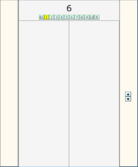
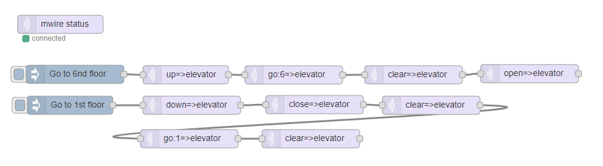

# Device simulator based on HTML5 and AngularJS

## Prerequisite

- [mosquitto](https://mosquitto.org) is runnig somewhere, for example, on RasPi.
- The mosquitto has been made(compiled) with WebSockets option enabled.
- angular.min.js and browserMqtt.js is accesible from a simulator.

Refer to the following links for mosquitto and browserMqtt.js:
- [obtaining mosquitto with WebSockets enabled](https://xperimentia.com/2015/08/20/installing-mosquitto-mqtt-broker-on-raspberry-pi-with-websockets/)
- [building browserMqtt.js](https://github.com/mqttjs/MQTT.js/)

## Architecture

```
[Script    ]                                         [Device simulator node]  
[AngularJS ]---mqtt/WebSocket---[mosquitto]---mqtt---[mqtt client          ]
[HTML5/CSS3]                                         [Node-RED             ]
```

## Sample device simulators

These simulators can be controlled by [mwire](../mwire) node.

### Hello World

[sample](./index.html)

### Elevator

[sample](./elevator.html)



Sample flow:



```
[{"id":"42768.3b3d2898c","type":"mwire","z":"998a3e69.02b2e","name":"elevator","device":"elevator","command":"go","args":"6","noack":false,"x":481.84722900390625,"y":141.1944580078125,"wires":[["44ad8f58.eedd3"]]},{"id":"a18d55ac.d53bc8","type":"mwire-status","z":"998a3e69.02b2e","name":"","params":"18f4a027.896b6","x":99.83677673339844,"y":58,"wires":[]},{"id":"9ac8f011.e3a","type":"inject","z":"998a3e69.02b2e","name":"","topic":"","payload":"Go to 6nd floor","payloadType":"str","repeat":"","crontab":"","once":false,"x":123.83329772949219,"y":140.1840362548828,"wires":[["c8869bab.cc3f68"]]},{"id":"ffd638a3.312378","type":"mwire","z":"998a3e69.02b2e","name":"elevator","device":"elevator","command":"open","noack":false,"x":867.7916259765625,"y":139.11111450195312,"wires":[[]]},{"id":"529c9da6.783eb4","type":"inject","z":"998a3e69.02b2e","name":"","topic":"","payload":"Go to 1st floor","payloadType":"str","repeat":"","crontab":"","once":false,"x":115.79158020019531,"y":191.11111450195312,"wires":[["e1b9d79e.b218b8"]]},{"id":"e1b9d79e.b218b8","type":"mwire","z":"998a3e69.02b2e","name":"elevator","device":"elevator","command":"down","noack":false,"x":314.79156494140625,"y":191.11111450195312,"wires":[["8827c08f.6f542"]]},{"id":"8827c08f.6f542","type":"mwire","z":"998a3e69.02b2e","name":"elevator","device":"elevator","command":"close","noack":false,"x":515.7915649414062,"y":190.11111450195312,"wires":[["1df771b.db38b8e"]]},{"id":"bdea6da5.ee118","type":"mwire","z":"998a3e69.02b2e","name":"elevator","device":"elevator","command":"go","args":"1","noack":false,"x":310.79156494140625,"y":246.11111450195312,"wires":[["851f9556.790fa8"]]},{"id":"851f9556.790fa8","type":"mwire","z":"998a3e69.02b2e","name":"elevator","device":"elevator","command":"clear","noack":false,"x":509.7916259765625,"y":246.11111450195312,"wires":[[]]},{"id":"1df771b.db38b8e","type":"mwire","z":"998a3e69.02b2e","name":"elevator","device":"elevator","command":"clear","noack":false,"x":706.7916259765625,"y":191.11111450195312,"wires":[["bdea6da5.ee118"]]},{"id":"c8869bab.cc3f68","type":"mwire","z":"998a3e69.02b2e","name":"elevator","device":"elevator","command":"up","args":"","noack":false,"x":305,"y":141,"wires":[["42768.3b3d2898c"]]},{"id":"44ad8f58.eedd3","type":"mwire","z":"998a3e69.02b2e","name":"elevator","device":"elevator","command":"clear","args":"","noack":false,"x":678,"y":141,"wires":[["ffd638a3.312378"]]},{"id":"18f4a027.896b6","type":"mwire-config","z":0,"server":"localhost:1883"}]
```

### Display

[sample](./display.html)


Sample flow:


### Video

This is a simple video player based on HTML5 video element.

[sample](./video.html)

## Working with one-liner HTTP server

Assuming that mosquitto is running on RasPi and all the files above are also on RasPi, use one-liner HTTP server to use the simulator on another PC.

Installation
```
$ npm install -g http-server
```

Usage
```
$ http-server
```
